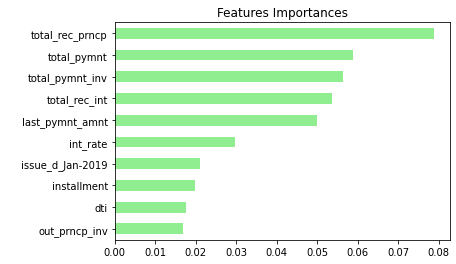

# Risky_Business: Using Machine Learning to Predict Credit Risk
Predict credit risk using resampling and ensemble learning using imbalanced-learn and Scikit-learn libraries

---

#### Resampling

Please reference "credit_risk_resampling.ipynb" in the Starter_Code folder for this section of our analysis.

We used the [imbalanced learn](https://imbalanced-learn.readthedocs.io) library to resample the LendingClub data and build and evaluate logistic regression classifiers using the resampled data.

We: 

1. Oversampled the data using the `Naive Random Oversampler` and `SMOTE` algorithms.
2. Undersampled the data using the `Cluster Centroids` algorithm.
3. Over- and under-sampled using a combination `SMOTEENN` algorithm.

For each of the above, we:

1. Trained a `logistic regression classifier` from `sklearn.linear_model` using the resampled data.
2. Calculated the `balanced accuracy score` from `sklearn.metrics`.
3. Calculated the `confusion matrix` from `sklearn.metrics`.
4. Printed the `imbalanced classification report` from `imblearn.metrics`.

#### Questions Answered:

##### WHICH MODEL HAD THE BEST BALANCED ACCURACY SCORE? 
* SMOTE Oversampling and Undersampling tied with a balanced accuracy score of 0.6549.
> 
> Naive Random Oversampling: 0.6512  
> SMOTE Oversampling: 0.6549  
> Undersampling: 0.6549  
> Combination: 0.5443  

##### WHICH MODEL HAD THE BEST RECALL SCORE?
* SMOTE Oversampling had the best average/total recall score of 0.69.
>
> Naive Random Oversampling: 0.56  
> SMOTE Oversampling: 0.69  
> Undersampling: 0.42  
> Combination: 0.57  

##### WHICH MODEL HAD THE BEST GEOMETRIC MEAN SCORE?
* SMOTE Oversampling had the best average/total geometric mean score of 0.65.
>
> Naive Random Oversampling: 0.64  
> SMOTE Oversampling: 0.65  
> Undersampling: 0.53  
> Combination: 0.63  

##### RESULTS TABLE:

|   | Naive Random Oversampling  | SMOTE Oversampling  | Undersampling  | Combination (Over and Under Sampling)  |
|---|---|---|---|---|
| Balanced Accuracy Score  | 0.6512  | 0.6549  | 0.6549  | 0.5443  |
| Recall Score (avg/total)  | 0.56  | 0.69  | 0.42  | 0.57  |
| Geometric Mean Score (avg/total)  | 0.64  | 0.65  | 0.53  | 0.63  |

---

#### Ensemble Learning

Please reference "credit_risk_ensemble.ipynb" in the Starter_Code folder for this section of our analysis.

In this section, we trained and compared two different ensemble classifiers to predict loan risk and evaluate each model. We used the `balanced random forest classifier` and the `easy ensemble AdaBoost classifier`.

We completed the following steps for each model:

1. Trained the model using the quarterly data from LendingClub provided in the `Resource` folder.
2. Calculated the balanced accuracy score from `sklearn.metrics`.
3. Print the confusion matrix from `sklearn.metrics`.
4. Generated a classification report using the `imbalanced_classification_report` from imbalanced learn.
5. For the balanced random forest classifier only, we printed the feature importance sorted in descending order (most important feature to least important) along with the feature score.

#### Questions Answered:

##### Which model had the best balanced accuracy score?
* The two models tied.
>
> Balanced Random Forest Classifier: 0.7885  
> Easy Ensemble AdaBoost Classifier: 0.7885  

##### Which model had the best recall score?
* The two models tied.
>
> Balanced Random Forest Classifier: 0.87  
> Easy Ensemble AdaBoost Classifier: 0.87  

##### Which model had the best geometric mean score?
* The two models tied.
>
> Balanced Random Forest Classifier: 0.78  
> Easy Ensemble AdaBoost Classifier: 0.78  

##### RESULTS TABLE:

|   | Balanced Random Forest Classifier  | Easy Ensemble AdaBoost Classifier  |
|---|---|---|
| Balanced Accuracy Score  | 0.7885  | 0.7885  |
| Recall Score (avg/total)  | 0.87  | 0.87  |
| Geometric Mean Score (avg/total)  | 0.78  | 0.78  |

##### What are the top three features?
* The top three features were total_rec_prncp, total_pymnt, and total_pymnt_inv as seen in this chart of results:

- - -